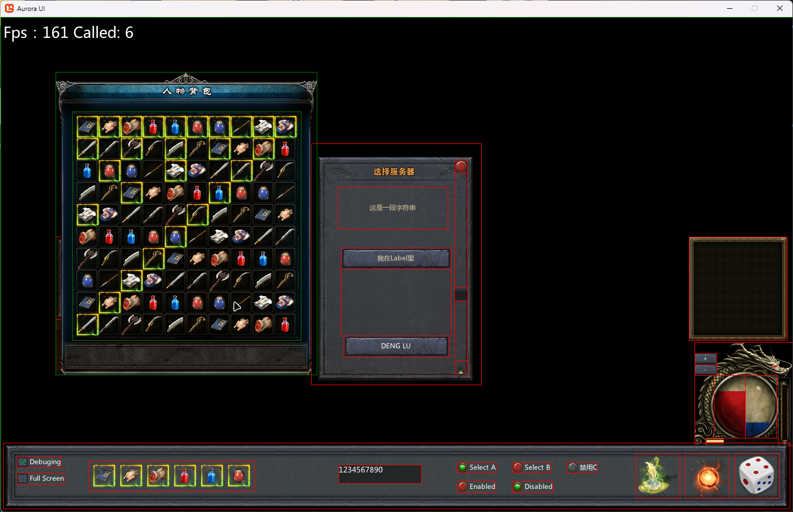

## Aurora.UI - UI Engine


It is a 2D UI engine based on MonoGame that is currently under development.

You can build your UI in XML, and it uses its own resource pack format

In theory, it's cross-platform

## Snapshot
[](./snapshot.png)


## Xml Document
``` xml
<?xml version="1.0" encoding="utf-8"?>
<Template xmlns="http://schemas.l2030.com/xaml/ui/controls"
	  xmlns:x="http://schemas.l2030.com/xaml/ui/default"
	  xmlns:sys="http://schemas.l2030.com/xaml/ui/system">
	
	<Template.Resource DefaultFont="Microsoft YaHei" Debuging="False">
		<sys:Package Name="ui" Path="./ui.asset" Password="" ></sys:Package>
		<sys:Font Name="Microsoft YaHei" Path="./Fonts/Microsoft YaHei.ttf" ></sys:Font>
		<sys:Font Name="HanYi XieJing" Path="./Fonts/HanYi XieJing.ttf" ></sys:Font>
	</Template.Resource>

	<Template.Cursor Skin="package://ui,17,10,1" State="Custom" />

	<Dialog Name="Window01" Background="package://grid,ui,30" AutoTop="True"  Pinned="False" Click="xxxxx_ssss" Margin="100,400,0,0" Size="400,150"  >
		<Button Name="Close" Image="package://ui,84,3,1"  Margin="0,0,0,0" HorizontalAlignment="Right"  Click="Button_Click" />
		<Button Name="Btn01" Font="HanYi XieJing" FontSize="32" Image="package://ui,66,3,1" TextColor="#e7dbb5" Content="可 用" Margin="48,48,0,0" Size="126,44"   Click="Button_Click" />
		<Button Name="Btn02" Image="package://ui,66,3,1" TextColor="#e7dbb5" Content="禁 用" Margin="200,48,0,0" Size="126,44" Enabled="False" Click="Button_Click" />
		<CheckBox Name="CheckBox01"  Image="package://ui,32,3,1" Icon="package://ui,34" Content="记住密码AA"  Margin="50,0,0,20" VerticalAlignment="Bottom"  Size="auto,20"   />
		<CheckBox Name="CheckBox01"  Image="package://ui,32,3,1" Icon="package://ui,34" Content="自动保存(Auto Save)"  Margin="200,0,0,20" Value="True" Enabled="False" VerticalAlignment="Bottom"  />
	</Dialog>


	<Dialog Name="Window02" Background="package://texture,ui,48" AutoTop="True"  Pinned="False" Click="xxxxx_ssss"  Size="309,439" HorizontalAlignment="Center" VerticalAlignment="Center">
		<Label Name="Label01" Content="这是一段字符串" HorizontalContentAlignment="Center" VerticalContentAlignment="Center"
			   TextColor="#d6c79c" Margin="48,80,0,0" Size="200,75" />
		<Label Name="Label02" TextColor="#e7dbb5" Margin="0,190,0,0" Size="200,160" HorizontalAlignment="Center" Padding="20,15">
			<Button Name="LabBtn" Image="package://ui,66,3,1"  TextColor="#e7dbb5" Content="我在Label里" Margin="0,0,0,0" HorizontalAlignment="Stretch"  VerticalAlignment="Top"   Click="Button_Click" />
		</Label>
		<Button Name="Btn02" Image="package://ui,66,3,1" VerticalAlignment="Bottom" HorizontalAlignment="Center"
				Size="auto,auto"	Content="DENG LU"	Margin="0,0,0,50" Click="Button_Click" />
		<ScrollBar Name="滚动条" HorizontalAlignment="Right" VerticalAlignment="Stretch" Margin="0,30,25,20"   Size="24,auto" >
			<ScrollBar.Slots>
				<Button x:Name="#BUTTON_DEC"  />
				<Button x:Name="#BUTTON_SLIDE"  />
				<Button x:Name="#BUTTON_INC"  />
			</ScrollBar.Slots>

			<Button Name="BUTTON_DEC" Image="package://ui,35,3,1"  Margin="0,0,0,0" Size="126,24"  HorizontalAlignment="Stretch" VerticalAlignment="Top" />
			<Button Name="BUTTON_SLIDE" Image="package://ui,37,3,1" Margin="0,50,0,0" Size="126,24" HorizontalAlignment="Stretch" VerticalAlignment="Center" />
			<Button Name="BUTTON_INC" Image="package://ui,36,3,1" Margin="0,0,0,0" Size="126,24" HorizontalAlignment="Stretch" VerticalAlignment="Bottom" />			
		</ScrollBar>
	</Dialog>

	<ListBox>
		<ListBox.Slots>
			<ScrollBar x:Name="#TMP_VERTICAL" ></ScrollBar>
			<ScrollBar x:Name="#TMP_HORIZONTAL" ></ScrollBar>
		</ListBox.Slots>
	</ListBox>

	<sys:Include Url="Xaml/abc.xml" />

	<Dialog Name="Status" Background="package://texture,ui,61" AutoTop="True" Pinned="True" Margin="0,0,0,120" HorizontalAlignment="Right" VerticalAlignment="Bottom" Size="178,188">
		<ProgressBar Name="HP" MinValue="0" MaxValue="100" Value="75" DelayTime="500" Margin="35,60,0,0" Size="auto,auto" Direction="BottomToTop" Texture="package://ui,62"></ProgressBar>
		<ProgressBar Name="MP" MinValue="0" MaxValue="100" Value="25" DelayTime="0" Margin="92,60,0,0" Size="auto,auto" Direction="BottomToTop" Texture="package://ui,63"></ProgressBar>
		<ProgressBar Name="EXP" MinValue="0" MaxValue="100" Value="25" DelayTime="800" Margin="21,174,0,0" Size="auto,auto" Direction="LeftToRight" Texture="package://ui,59"></ProgressBar>
		<Button Name="Add" Image="package://ui,66,3,1" TextColor="#e7dbb5" Content="+" VerticalAlignment="Top" Margin="0,20,0,0" Size="40,20"   Click="PBAdd_Click" />
		<Button Name="Dec" Image="package://ui,66,3,1" TextColor="#e7dbb5" Content="-" VerticalAlignment="Top" Margin="0,40,0,0" Size="40,20"  Click="PBDec_Click" />
	</Dialog>

	<Dialog Name="MainConsole" Background="package://grid,ui,30" AutoTop="True" Pinned="True" Margin="5,0,5,5" HorizontalAlignment="Stretch" VerticalAlignment="Bottom" Size="1440,120">
		<Image Name="Image01" Margin="300,20,0,0" Texture="package://ui,24" FillMode="None" Size="80,80" Click="Image_Click" />
		<Image Name="Image01" Margin="150,20,0,0" Texture="package://ui,25" FillMode="Stretch" Size="80,80" Click="Image_Click" />
		<Animation Name="Animation01" Margin="0,20,20,0" Textures="package://ui,0-15" Size="80,80" HorizontalAlignment="Right" FillMode="Stretch" Interval="50" ></Animation>
		<CheckBox Name="Debug"  Image="package://ui,32,3,1" Icon="package://ui,33" FontSize="16" Content="Debuging"  Margin="25,25,0,0" Value="False" Click="Debuging_Click" />
		<CheckBox Name="Full Screen"  Image="package://ui,32,3,1" Icon="package://ui,33" Content="Full Screen"  Margin="25,55,0,0" Value="False" Click="FullScreen_Click" />


		<Radio Name="Select A" GroupName="A"  Image="package://ui,35,3,1" Icon="package://ui,36" Content="Select A"  Margin="825,35,0,0" Value="True"  />
		<Radio Name="Select B" GroupName="A"  Image="package://ui,35,3,1" Icon="package://ui,36" Content="Select B"  Margin="925,35,0,0" Value="False"  />
		<Radio Name="Select C" GroupName="A"  Image="package://ui,35,3,1" Icon="package://ui,36" Content="Select C"  Margin="1025,35,0,0" Value="False" Enabled="False" />


		<Radio Name="Enabled B" GroupName="B"  Image="package://ui,35,3,1" Icon="package://ui,36" Content="Enabled"  Margin="825,70,0,0" Value="False"  />
		<Radio Name="Disabled B" GroupName="B"  Image="package://ui,35,3,1" Icon="package://ui,36" Content="Disabled"  Margin="925,70,0,0" Value="True"  />

		<TextBox Name="InputBox" Background="package://grid,ui,37" Font="textbox-font" FontSize="18" Text="1234567890" Margin="610,40,0,0"  Size="150,34"/>
		

	</Dialog>

</Template>
```


## Credits
* [MonoGame](http://www.monogame.net/)
* [SpriteFontPlus 7.0.22 Source Code](https://github.com/rds1983/SpriteFontPlus)


 